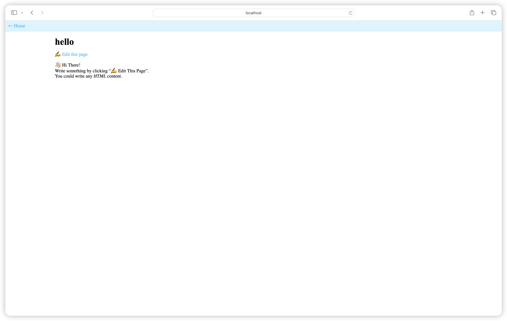

# Go Wiki
An wiki written by Go.



# Deploy
## Preseves
- You need to [install Go](https://go.dev/doc/install) language on your PC.
- Configured Git and Github environment.

## Steps
1. Download the repository.

   Visit https://github.com/ZenkieBear/learn-go, click "Code" button.

   Click “Download ZIP”, or copy and clone the repository on your PC.
2. Start the application
   
   ```sh
   cd gowiki
   go run gowiki
   ```
   “👌 Wiki is running on: http://localhost:8000” means your application started correctly!
3. Visit http://localhost:8000 in your browser

# Files
```
|- data/
  |-hello.txt
|- templates/
  |- edit.html
  |- index.html
  |- view.html
|- ...
|- wiki.go
```
- `data`: The directory stored page datas.
- `templates`: Some page frames.
- `wiki.go`: The main program.

# Configure
All in `wiki.go`
## Template caching
You can make `isDev` false to enable template caching. In development, caching is unnessesary.

## Custom Storage Paths
You can change the storage paths by editing `dataPath` and `templatePath`

# Ending
Thank you for seeing this！ 🙏